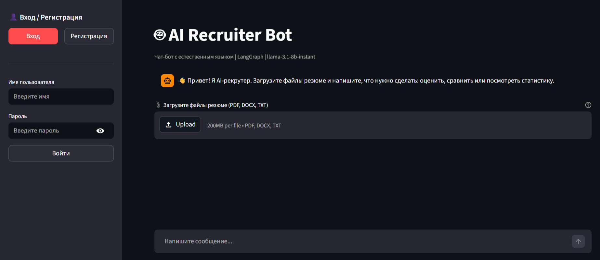

# AI Recruiter Bot

Прототип системы для многокритериальной оценки IT-резюме с ИИ-скорингом и чат-ботом. Разработан в рамках выпускной квалификационной работы бакалавра НИУ ВШЭ (2026).

**Стек:** Python, LangGraph, Groq API (Llama 3.3 70B), Streamlit, SQLite.

---

## Возможности

- Оценка резюме по четырём критериям с весами: Hard Skills (35%), Soft Skills (25%), Опыт (25%), Адаптивность (15%)
- Генерация объяснений на естественном языке по каждому критерию
- Определение IT-роли кандидата (Backend, Frontend, Data Science и др.)
- Сравнение двух кандидатов с параллельным сопоставлением баллов
- Массовая загрузка до 5 резюме с экспортом в CSV
- Сбор обратной связи и пополнение базы few-shot примеров
- Эвристический fallback при недоступности LLM API

---

## Скриншоты

| Главный экран |
|:---:|:---:|
|  | 

---

## Быстрый старт

```bash
git clone https://github.com/GolAliSer/ai-recruiter-bot.git
cd ai-recruiter-bot/ResumeScoring
pip install -r requirements.txt
# Создать .env с ключом GROQ_API_KEY
streamlit run app.py
